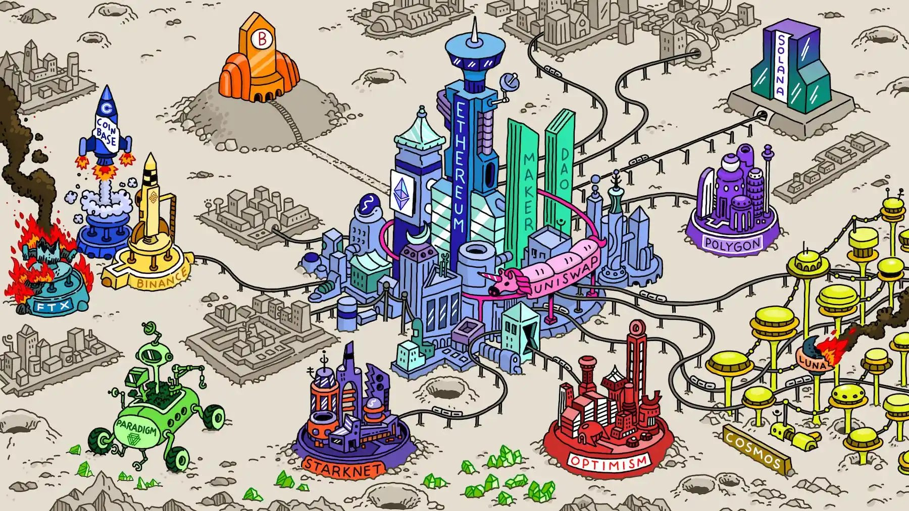

# 简单介绍

关于我： [@kuzicrypto](https://x.com/kuzicrypto)

Web3 码农，也是链上 Degen.&#x20;

19年入行的一颗韭菜，从硬件矿工到 Defi理财，从Coding仔到链上赌狗。

谢谢 Bitcoin 让我拥有一份加密信仰。

币圈投资是一门很难的事情，即要学会赚钱，也要活的久。

市场兴衰更替，每天都在进化，持续学习，赚辛苦钱，也赚快乐钱。

这里写写我的个人投资笔记和工具记录，帮助自己学习和复盘，也希望可以帮助到朋友一起成长。

<figure><figcaption></figcaption></figure>

